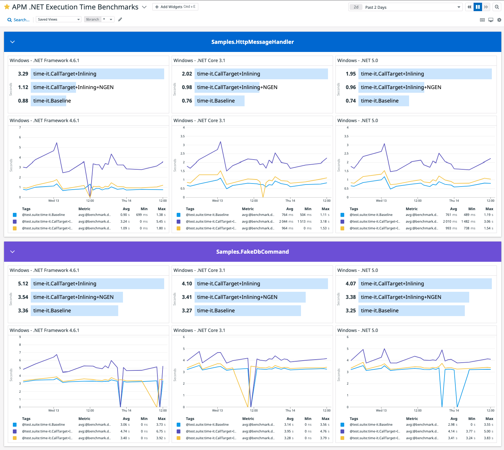

# timeit
Command execution time meter allows to configure multiple scenarios to run benchmarks over CLI apps, output are available in markdown and as datadog traces.

## Installation

```bash
go get github.com/tonyredondo/timeit
```

### Usage
```bash
timeit [configuration file.json]
```

## Sample Configuration

```json
{
  "enableDatadog": true,
  "warmUpCount": 10,
  "count": 50,
  "scenarios": [
    {
      "name": "Callsite",
      "environmentVariables": {
        "DD_TRACE_CALLTARGET_ENABLED": "false",
        "DD_CLR_ENABLE_INLINING": "false"
      }
    },
    {
      "name": "CallTarget",
      "environmentVariables": {
        "DD_TRACE_CALLTARGET_ENABLED": "true",
        "DD_CLR_ENABLE_INLINING": "false"
      }
    },
    {
      "name": "CallTarget\u002BInlining",
      "environmentVariables": {
        "DD_TRACE_CALLTARGET_ENABLED": "true",
        "DD_CLR_ENABLE_INLINING": "true"
      }
    }
  ],
  "processName": "dotnet",
  "processArguments": "--version",
  "environmentVariables": {
    "CORECLR_ENABLE_PROFILING": "1",
    "CORECLR_PROFILER": "{846F5F1C-F9AE-4B07-969E-05C26BC060D8}",
    "CORECLR_PROFILER_PATH": "/Datadog.Trace.ClrProfiler.Native.dylib",
    "DD_DOTNET_TRACER_HOME": "/",
    "DD_INTEGRATIONS": "/integrations.json"
  }
}
```

## Sample output

```bash
C:\github\timeit>go run main.go config_example.json
Warmup count: 10
Count: 50
Number of scenarios: 3

Scenario: Callsite => [dotnet --version]
  Warming up..........
  Run..................................................

Scenario: CallTarget => [dotnet --version]
  Warming up..........
  Run..................................................

Scenario: CallTarget+Inlining => [dotnet --version]
  Warming up..........
  Run..................................................


### Results

|  CALLSITE  | CALLTARGET | CALLTARGET+INLINING |
|------------|------------|---------------------|
| 110.6009ms | 112.4125ms |     133.1758ms      |
| 129.6107ms | 109.338ms  |      122.232ms      |
| 130.2464ms | 112.7058ms |     121.5323ms      |
| 115.1808ms | 112.9285ms |     119.9177ms      |
| 127.1896ms | 120.2813ms |     114.9465ms      |
| 129.0005ms | 129.4813ms |     113.5153ms      |
| 136.8764ms | 123.013ms  |     117.1291ms      |
| 117.326ms  | 106.7125ms |     109.6774ms      |
| 125.5962ms | 112.1783ms |     129.5245ms      |
| 135.685ms  | 109.6591ms |      128.208ms      |
| 141.4111ms | 117.4075ms |     124.4313ms      |
| 127.765ms  | 113.7607ms |     117.7982ms      |
| 125.6363ms | 116.4419ms |     117.7378ms      |
| 116.609ms  | 119.3874ms |     124.8442ms      |
| 106.0795ms | 117.4357ms |     106.1421ms      |
| 159.7661ms | 111.6672ms |     109.2672ms      |
| 130.7003ms | 129.6644ms |     110.5971ms      |
| 119.0937ms | 119.8105ms |     105.6687ms      |
| 114.6655ms | 133.0765ms |     132.2974ms      |
| 131.2181ms | 107.5558ms |     121.5232ms      |
| 148.6512ms | 105.8495ms |     114.5084ms      |
| 129.2509ms | 111.4591ms |     107.1584ms      |
| 130.3749ms | 116.9434ms |     111.0894ms      |
| 127.1986ms | 132.3352ms |     118.7023ms      |
| 112.0615ms | 137.2075ms |     137.8718ms      |
| 110.5799ms | 139.2661ms |     124.5266ms      |
| 120.9388ms | 130.2155ms |     119.8089ms      |
| 118.4319ms |  126.36ms  |     113.7608ms      |
| 108.6838ms | 116.4019ms |     128.8038ms      |
| 119.9328ms | 142.5005ms |      121.053ms      |
| 122.5775ms | 120.1319ms |     133.2083ms      |
| 131.3569ms | 110.3926ms |      114.518ms      |
| 145.3262ms | 112.9795ms |      110.246ms      |
| 141.3587ms | 125.6264ms |     125.3032ms      |
| 122.0993ms | 124.8166ms |     107.1881ms      |
| 121.7378ms | 119.5713ms |     103.7624ms      |
| 123.2787ms | 124.054ms  |     121.0545ms      |
| 139.3624ms | 126.8219ms |     123.3312ms      |
| 128.6386ms | 120.0398ms |      124.127ms      |
| 146.8633ms | 109.4716ms |     122.3357ms      |
| 146.8817ms | 112.2939ms |     133.9094ms      |
| 128.1448ms | 118.0233ms |     110.7925ms      |
| 133.2585ms | 123.5743ms |     107.4477ms      |
| 113.0227ms | 120.2665ms |     127.0872ms      |
| 119.7557ms | 106.4997ms |     135.0651ms      |
| 121.0891ms | 133.0274ms |     114.3656ms      |
| 105.8333ms | 131.5713ms |     110.4421ms      |
| 135.293ms  | 108.2866ms |      99.5165ms      |
| 112.3427ms | 105.6776ms |     132.7953ms      |
| 98.1791ms  | 116.6964ms |      109.271ms      |

### Summary

|        NAME         |     MEAN     |    STDEV    |     P99     |     P95     |    P90     |
|---------------------|--------------|-------------|-------------|-------------|------------|
| Callsite            | 125.855228ms | 12.376733ms | 154.20865ms | 146.8725ms  | 141.4111ms |
| CallTarget          | 119.265584ms | 9.270287ms  | 140.8833ms  | 135.142ms   | 132.3352ms |
| CallTarget+Inlining | 118.86432ms  | 9.298353ms  | 136.46845ms | 133.55885ms | 132.7953ms |
```

### Tables are markdown compatible:

### Summary

|        NAME         |     MEAN     |    STDEV    |     P99     |     P95     |    P90     |
|---------------------|--------------|-------------|-------------|-------------|------------|
| Callsite            | 125.855228ms | 12.376733ms | 154.20865ms | 146.8725ms  | 141.4111ms |
| CallTarget          | 119.265584ms | 9.270287ms  | 140.8833ms  | 135.142ms   | 132.3352ms |
| CallTarget+Inlining | 118.86432ms  | 9.298353ms  | 136.46845ms | 133.55885ms | 132.7953ms |

## Datadog Exporter

Spans for each run are created and sent to datadog backend:


